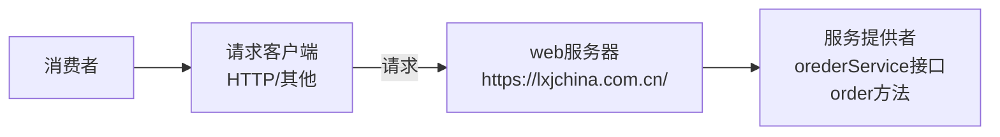

# EchoRPC

基于 Java + Etcd + Vert.x 的高性能RPC框架

- [x] 基础RPC功能
- [ ] 全局配置加载（properties √ & yaml ×）
- [ ] 接口Mock
- [ ] 自定义序列化器
- [ ] 自定义协议实现（基于TCP）
- [ ] 注册中心实现
- [ ] 负载均衡机制
- [ ] 重试机制
- [ ] 容错机制

# 1 概述

## 什么是RPC框架？

**RPC** （Remote Procedure Call，远程过程调用）框架是一种软件框架，允许程序在不同的地址空间（例如，在不同的机器上）执行彼此的方法或函数，仿佛它们是本地调用的一部分。RPC框架旨在简化分布式计算，使开发者可以更方便地构建和使用跨网络的服务。

**RPC调用示例**

点餐服务和接口的示例伪代码如下：

```java
interface OrderService {
    //点餐，返回orderID
    long oreder(参数1，参数2，参数3)
}
```

- HTTP请求调用

  ```java
  url = "https://lxjchina.com.cn/"
  req = new Req(参数1，参数2，参数3)
  res = httpClient.post(url).body(req).execute()
  orderId = res.data.orderId
  ```

- RPC调用

  ```java
  orderId = orderService.order(参数1，参数2，参数3)
  ```

  

## 常见的RPC框架

**gRPC**：

- 由Google开发，基于HTTP/2和Protocol Buffers。
- 支持多种编程语言。
- 高性能、双向流、负载均衡等特性。

**Thrift**：

- 由Facebook开发，支持多种编程语言。
- 提供接口定义语言（IDL）来定义服务和数据类型。

**Apache Dubbo**：

- 一个高性能的Java RPC框架，广泛用于阿里巴巴的服务。
- 支持多种协议和序列化方式，具有服务治理功能。

**XML-RPC**：

- 基于XML格式的简单RPC协议。
- 通过HTTP进行通信，较为简单和易于理解。

**JSON-RPC**：

- 基于JSON格式的RPC协议。
- 通常通过HTTP或WebSocket进行通信，较为轻量和易于集成。


## RPC和HTTP有什么区别？

- 协议不同: HTTP 是一种应用层协议，用于传输超文本文档。RPC 是一种允许程序调用另一个地址空间（通常是在远程系统上）的过程或函数的协议。

- 格式不同: HTTP 消息通常是文本格式的，可以包含 HTML、JSON、XML 等多种格式的数据。RPC 消息通常是二进制格式的。

- 目的不同: HTTP 通常用于 Web 浏览器和 Web 服务器之间的通信。RPC 通常用于分布式系统中的进程间通信。

- 效率不同: HTTP 通信的开销比 RPC 大，因为 HTTP 消息包含很多额外的头信息。RPC 通常更高效，因为它使用二进制格式的消息。

注意: 在实践中，HTTP 和 RPC 通常可以互相转换。例如，可以使用 HTTP 作为 RPC 的传输层协议。例如，gRPC 是一个 RPC 框架，它使用 HTTP/2 作为传输层协议。

## OpenFeign？

OpenFeign是Spring Cloud的一个组件，主要用于简化微服务之间的HTTP调用。它是一个声明式的Web服务客户端，能够让编写Web服务客户端更加简单。OpenFeign直接可以根据服务名称从注册中心获取指定的服务IP集合，并提供了接口和注解方式进行调用。它内嵌集成了Ribbon负载均衡器，支持Spring MVC的注解，如@RequestMapping等。

与Feign相比，OpenFeign是Spring Cloud自己研发的，并在Feign的基础上增加了对Spring MVC注解的支持。Feign是Netflix公司开发的轻量级RESTful HTTP服务客户端，但不支持Spring MVC的注解。

##  Dubbo vs OpenFeign

Dubbo是一种基于RPC的分布式服务框架。它支持高性能的服务注册发现和远程通信。通常情况下，Dubbo适用于需要高性能、高可靠性和复杂服务治理的场景。它提供了丰富的功能，比如说负载均衡、超时处理、熔断降级等等。适用于复杂的微服务体系架构。适用于**需要更高性能、可靠性和高级功能**

OpenFeign是一个声明式的HTTP客户端。它简化了基于HTTP的远程通信过程。OpenFeign适用于简单的微服务场景，特别是当你的微服务之间使用HTTP通信，并且希望通过接口来定义客户端调用的时候。OpenFeign是一个很好的选择，它可以把HTTP请求转换成Java接口方法调用，提供了方便的开发体验。适用于**需求相对简单，希望提高开发效率**

# 2 简易RPC 框架的实现思路

## 2.1 简易RPC框架结构设计

考虑一下场景，消费者A想调用自身进程内点餐服务orderService接口中的order方法。

```java
orderService.order(args[]);
```

那orderService不是自身进程提供的呢？有一个餐馆服务商，提供了order方法

常规的调用方法：



若服务提供者提供了多个服务和接口，针对每个接口都写一个HTTP调用接口及逻辑，过于复杂。

**解决方案：**

提供一个统一的服务调用接口，通过`请求处理器`根据客户端的请求参数来进行不同的处理，调用不同的服务和方法。

请求处理器如何知道该怎么调用方法呢？

可以在服务提供者程序维护一个`本地服务注册器`，记录服务和对应实现类的映射。

消费者要调用 `ordersenice` 服务的 `order`方法，可以发送清求，参数为 `service=orderservice,method=order` ，然后请求处理器会根据 `serice` 从服
务注册器中找到对应的服务实现类，并且通过 Java 的反射机制调用 `method` 指定的方法。

> **反射机制**是 Java 语言的一大重要特性，它使得程序可以在运行时动态地获取有关类和对象的信息，并能够调用对象的方法或访问对象的属性。通过反射机制，Java 能够在不用预先知道类的情况下处理类和对象。

由于Java对象无法直接在网路中传输，所以要对传输的参数进行序列化和反序列化。


如上图所示，虚线框部分就是PRC框架所需要提供的基础功能。

## 2.2 RPC框架的简易实现

1. **easy-rpc框架**
```
EchoRPC 简易版框架
├── echo-rpc-easy
├── example-common
├── example-consumer
├── example-provider
```
   在example-common模块编写User实体类（需实现序列化接口，方便网络传输）和服务接口UserService（提供getUser（）方法，但不实现）

   服务提供者example-provider ，实现服务接口 UserServiceImpl

   服务消费者example-consumer，调用 `User newUser = userService.getUser(user);`

2. **Web服务器**

   需要让服务提供者提供**可远程访问**的服务，需要用到web服务器，能够接受处理请求，返回响应。

   本项目使用高性能NIO框架的Vert.x来作为RPC框架的web服务器。

   >**Tomcat**:  Tomcat 是一个Servlet容器，主要用于处理HTTP请求。如果需要一个高效的RPC框架，使用Tomcat显得过于笨重和不合适。Tomcat的同步阻塞模型不适合高性能RPC需求。
   >
   >**Netty**：高性能、异步事件驱动的网络应用框架，适用于构建高并发、高吞吐量的网络应用。就应用开发的角度来水，Vert.x的学习成本相对于Netty⽽⾔更少。

3. **本地注册服务器**

   因为消费者与提供者之间需要进⾏⽹络通讯的话，需要我们在注册中⼼ 获取到提供者注册的信息，那么消费者根据获取到的信息，再进⼀步进⾏⽹络通 讯，进⽽调⽤提供者给到的服务。

   简易框架就先使用本地存储来实现。

   ```java
    private static final Map<String, Class<?>> map = new ConcurrentHashMap<>();
   ```

   > `ConcurrentHashMap` 是线程安全的，这意味着它可以在多线程环境中安全地进行读写操作而不需要额外的同步机制。对于RPC框架来说，注册中心服务很可能会被多个线程并发访问，例如服务注册和服务发现操作。因此，使用线程安全的数据结构非常重要。

4. **序列化器**

   序列化（Serialization）是将对象的状态转换为字节流的过程。这个过程使得对象可以被存储到磁盘或通过网络传输，并在需要的时候重新恢复为对象。

   反序列化（Deserialization）是将字节流转换回对象的过程。通过反序列化，可以将序列化的字节流恢复为原始的对象。

   对于Java来说，对象存在于JVM虚拟机中，如果需要将对象持久化存储/通过网络传输/深复制，就需要将对象转换为字节流。

   > - **Java内置Serializable**：简单易用，但适用于仅Java环境。
   > - **JSON（如Jackson或Gson）**：跨语言，文本格式，易读。
   > - **XML（如JAXB）**：跨语言，自描述，适合复杂数据结构。
   > - **Protocol Buffers**：高效、跨语言、严格数据结构。

   简易框架使用JDK内置序列化器。先写序列化接⼝，再写JDK序列化器，便于以后扩展。

5. **请求处理器(提供者接收到请求后的⽽处理)**

   当web服务器获取到请求的数据后，需要经过请求处理器进⾏处理。

   1. 将请求发送过来的字节数组数据进⾏反序列化为对象，便于后续的使⽤

      ```java
      byte[] bytes = body.getBytes();
      rpcRequest = serializer.deserialize(bytes, RpcRequest.class);
      ```

   2. 因为提供者已经将服务注册到本地注册器，那么我们只需要使⽤反序列化得到 的对象中的服务名，通过get⽅法获取得到服务实现类

      ```java
      Class<?> implClass = LocalRegistry.get(rpcRequest.getServiceName());
      ```

   3. 通过反射的⽅式，进⾏实现类中的⽅法调⽤

      ```java
      Method method = implClass.getMethod(rpcRequest.getMethodName(), rpcRequest.getParameterTypes());
                      Object result = method.invoke(implClass.newInstance(), rpcRequest.getArgs());
      ```

   4. 最后将得到的结果，通过响应类进⾏封装，最后再响应出去给调⽤者，当响应 出去的时候，同样也要⽤到序列化，可以理解为，在本地处理逻辑⽤对象，在 ⽹络传输之间⽤字节数组。

      ```java
      rpcResponse.setData(result);
      
      doResponse(request, rpcResponse, serializer);
      ```

6. **代理服务（消费方发起调用）**


- **静态代理：**
   构造HTTP请求去调用服务提供者。为每一个服务都提供一个实现类。灵活性较差，RPC框架中，常使用动态代理。

- **动态代理：** 
  动态代理的作用是，根据要生成的对象的类型，自动生成一个代理对象，常用的动态代理实现方式有 JDK动态代理和基于字节码生成的动态代理(比如CGLIB)。前者简单易用、无需引入额外的库，但缺点是只能对接口进行代理;后者更灵活、可以对任何类进行代理，但性能略低于JDK动态代理。此处使用 JDK 动态代理。

  逻辑：通过⼯⼚模式，填⼊要获取的类的代理，例如

  ```java
   UserService userService = ServiceProxyFactory.getProxy(UserService.class);
  ```
  
  ```java
   public static <T> T getProxy(Class<T> serviceClass) {   
  // 使用Proxy.newProxyInstance创建代理实例，其中传入的服务类加载器、实现的接口列表和服务代理实例。
          return (T) Proxy.newProxyInstance(
                  serviceClass.getClassLoader(),
                  new Class[]{serviceClass},
                  new ServiceProxy());
      }
  ```
  
  

  至此，一个简易的RPC框架就完成了。

  

  

  

# 3 EchoRPC 功能实现

## 3.1 全局配置加载

RPC框架运行时，会设计注入服务地址，端口号等信息，在简易版项目中，是在程序里面写死，不利于维护。需要通过引入全局配置文件来自定义配置。

**基础配置项** 

- name 名称
- version 版本
- servverHost 服务器主机名

**加载properties配置**

```java
    public static <T> T loadConfig(Class<T> tClass, String prefix, String environment) {
        StringBuilder configFileBuilder = new StringBuilder("application");
        if (StrUtil.isNotBlank(environment)) {
            //区分不同环境的配置
            configFileBuilder.append("-").append(environment);
        }
        configFileBuilder.append(".properties");
        Props props = new Props(configFileBuilder.toString());
        return props.toBean(tClass, prefix);
    }
```

**加载yaml配置 （暂时搁置）** 

- 问题一：判断存在哪些文件 `resourceExists(ymlFile)`

  会读取出不在 `resources/` 目录下的文件

  ```bash
  Thread.currentThread().getContextClassLoader().getResource(resource)
  
  file:/C:/Users/Administrator/.config/.cool-request/request/lib/spring-invoke-starter.jar!/application.properties
  ```

​		（把`resourceExists(propertiesFile)`暂时放后面 bushi

- yaml-->map-->bean    依赖snakeyaml
- yaml -->properties

## 3.2 接口Mock

需要使用mock服务来模拟远程服务的行为，以便进行接口测试、开发和调试。

配置Mock代理

```java
package com.keriko.echorpc.proxy;

import lombok.extern.slf4j.Slf4j;
import java.lang.reflect.InvocationHandler;
import java.lang.reflect.Method;

/**
 * Mock 服务代理（JDK 动态代理）
 *
 */
@Slf4j
public class MockServiceProxy implements InvocationHandler {


    /**
     * 调用代理对象的方法。
     * 当通过代理对象调用实际方法时，此方法将被触发。它首先记录方法的调用信息，
     * 然后返回一个默认对象，该对象的类型与调用方法的返回类型匹配。
     * 这种方式常用于模拟或测试场景， where 无需实际执行方法逻辑，
     * 但需要返回一个合法的对象以供后续处理。
     *
     * @param proxy 代理对象，即调用方法的对象。
     * @param method 被调用的方法。
     * @param args 方法的参数数组。
     * @return 返回一个与方法返回类型匹配的默认对象。
     * @throws Throwable 如果方法执行过程中抛出异常，则抛出。
     */
    @Override
    public Object invoke(Object proxy, Method method, Object[] args) throws Throwable {
        // 记录方法调用信息
        // 根据方法的返回值类型，生成特定的默认值对象
        Class<?> methodReturnType = method.getReturnType();
        log.info("mock invoke {}", method.getName());

        // 根据方法的返回类型返回一个默认对象
        return getDefaultObject(methodReturnType);
    }


    /**
     * 生成指定类型的默认值对象。对于基本类型，返回对应的默认值；对于引用类型，返回null。
     * 使用时，请确保类型参数非null，或在调用处捕获可能的NullPointerException。
     *
     * @param type 类型参数，不能为null。
     * @return 指定类型默认值的对象表示。
     */
    private Object getDefaultObject(Class<?> type) {
        // 增加非空检查
        if (type == null) {
            throw new IllegalArgumentException("Type parameter cannot be null.");
        }

        // 基本类型处理
        if (type.isPrimitive()) {
            // 基本类型处理
            if (type == boolean.class) {
                return false;
            } //8种基本数据类型处理
        }
        // 引用类型处理
        return null;
    }

}

```

判断是否开启了Mock

```java
public static <T> T getProxy(Class<T> serviceClass) {
        log.info("getProxy: {}", serviceClass.getName());
        if (RpcApplication.getRpcConfig().isMock()) {
            return getMockProxy(serviceClass);
        }

        return (T) Proxy.newProxyInstance(
                serviceClass.getClassLoader(),
                new Class[]{serviceClass},
                new ServiceProxy());
    }
```


## 3.3 自定义序列化器

主流序列化器及其对比（DeepSeek）

1. JSON (JavaScript Object Notation)

- **优点**:
  - 易于阅读和编写，适合人类和机器。
  - 轻量级，数据格式简单。
  - 广泛支持，几乎所有编程语言都有JSON库。
  - 适合Web应用，易于与REST API集成。
- **缺点**:
  - 不支持复杂数据类型，如日期、时间等。
  - 性能相对较低，特别是在大数据集上。
  - 不支持二进制数据，只能处理文本。

2. XML (eXtensible Markup Language)

- **优点**:
  - 结构化数据，易于阅读和编写。
  - 支持复杂数据类型和嵌套结构。
  - 广泛支持，几乎所有编程语言都有XML库。
  - 支持命名空间和模式定义。
- **缺点**:
  - 冗长，数据量较大。
  - 性能相对较低，特别是在大数据集上。
  - 解析和生成速度较慢。

3. Protocol Buffers (protobuf)

- **优点**:
  - 高效，二进制格式，体积小，速度快。
  - 支持复杂数据类型和嵌套结构。
  - 跨语言支持，Google开发，广泛使用。
  - 版本兼容性好，支持字段添加和删除。
- **缺点**:
  - 二进制格式，不易阅读和手动编写。
  - 需要定义`.proto`文件，增加了开发复杂度。
  - 不适合需要人类可读性的场景。

4. Apache Avro

- **优点**:
  - 高效，二进制格式，体积小，速度快。
  - 支持复杂数据类型和嵌套结构。
  - 跨语言支持，广泛用于大数据处理。
  - 动态类型，无需生成代码。
- **缺点**:
  - 二进制格式，不易阅读和手动编写。
  - 需要定义Schema文件，增加了开发复杂度。
  - 不适合需要人类可读性的场景。

5. MessagePack

- **优点**:
  - 高效，二进制格式，体积小，速度快。
  - 支持复杂数据类型和嵌套结构。
  - 跨语言支持，广泛用于高性能应用。
  - 动态类型，无需生成代码。
- **缺点**:
  - 二进制格式，不易阅读和手动编写。
  - 需要定义Schema文件，增加了开发复杂度。
  - 不适合需要人类可读性的场景。

6. YAML (YAML Ain't Markup Language)

- **优点**:
  - 易于阅读和编写，适合人类和机器。
  - 支持复杂数据类型和嵌套结构。
  - 广泛支持，几乎所有编程语言都有YAML库。
  - 适合配置文件和数据交换。
- **缺点**:
  - 性能相对较低，特别是在大数据集上。
  - 不支持二进制数据，只能处理文本。
  - 可能存在解析歧义。

7. Thrift

- **优点**:

  - 高效，二进制格式，体积小，速度快。
  - 支持复杂数据类型和嵌套结构。
  - 跨语言支持，广泛用于高性能应用。
  - 支持RPC调用。

- **缺点**:

  - 二进制格式，不易阅读和手动编写。
  - 需要定义`.thrift`文件，增加了开发复杂度。
  - 不适合需要人类可读性的场景。

  需求：自行实现一个序列化器，允许调用者指定序列化器（自行实现）


