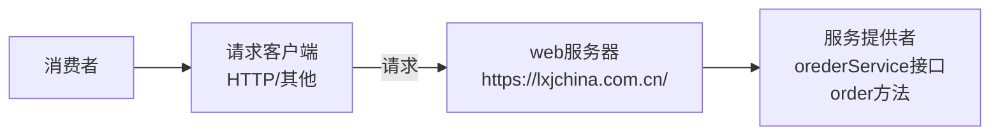
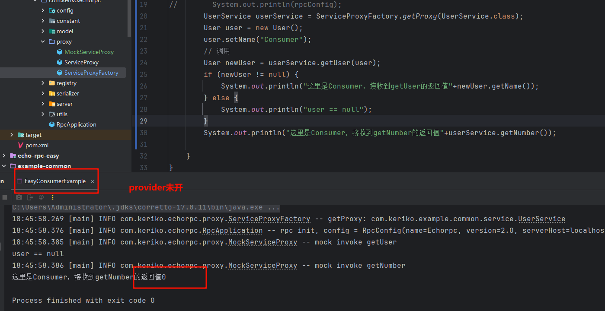
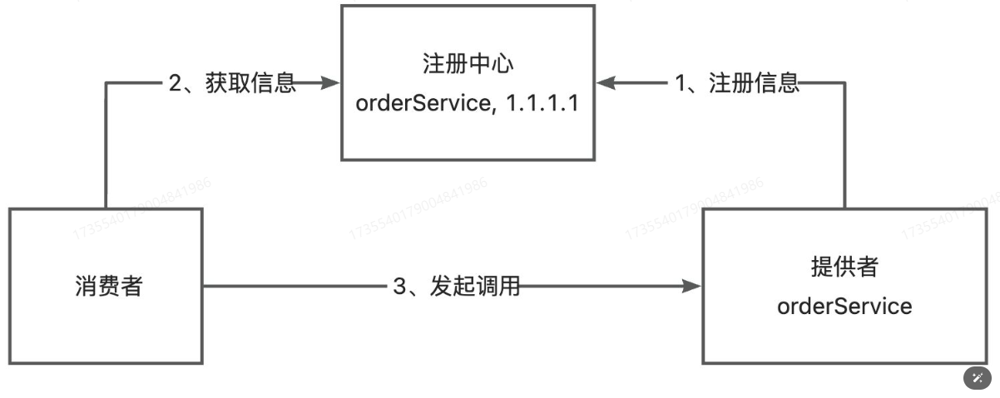
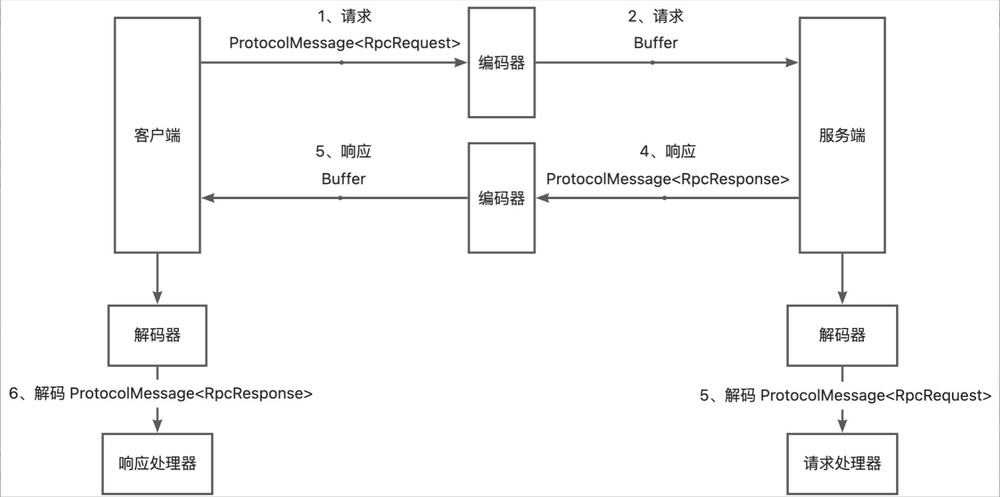

# EchoRPC

基于 Java + Etcd + Vert.x 的高性能RPC框架

- [x] 基础RPC功能
- [x] 全局配置加载
- [ ] 配置加载兼容yaml 
- [x] 接口Mock
- [x] 自定义序列化器
- [x] hessian，json， kryo等序列化器实现
- [x] 注册中心实现
- [x] 注册中心优化（心跳）
- [x] 自定义协议实现（基于TCP）
- [x] 协议优化（比特位实现），自定义序列化器枚举值获取
- [x] 负载均衡机制
- [x] 重试机制
- [x] 容错机制

# 1 概述

## 什么是RPC框架？

**RPC** （Remote Procedure Call，远程过程调用）框架是一种软件框架，允许程序在不同的地址空间（例如，在不同的机器上）执行彼此的方法或函数，仿佛它们是本地调用的一部分。RPC框架旨在简化分布式计算，使开发者可以更方便地构建和使用跨网络的服务。

**RPC调用示例**

点餐服务和接口的示例伪代码如下：

```java
interface OrderService {
    //点餐，返回orderID
    long oreder(参数1，参数2，参数3)
}
```

- HTTP请求调用

  ```java
  url = "https://lxjchina.com.cn/"
  req = new Req(参数1，参数2，参数3)
  res = httpClient.post(url).body(req).execute()
  orderId = res.data.orderId
  ```

- RPC调用

  ```java
  orderId = orderService.order(参数1，参数2，参数3)
  ```

  

## 常见的RPC框架

**gRPC**：

- 由Google开发，基于HTTP/2和Protocol Buffers。
- 支持多种编程语言。
- 高性能、双向流、负载均衡等特性。

**Thrift**：

- 由Facebook开发，支持多种编程语言。
- 提供接口定义语言（IDL）来定义服务和数据类型。

**Apache Dubbo**：

- 一个高性能的Java RPC框架，广泛用于阿里巴巴的服务。
- 支持多种协议和序列化方式，具有服务治理功能。

**XML-RPC**：

- 基于XML格式的简单RPC协议。
- 通过HTTP进行通信，较为简单和易于理解。

**JSON-RPC**：

- 基于JSON格式的RPC协议。
- 通常通过HTTP或WebSocket进行通信，较为轻量和易于集成。


## RPC和HTTP有什么区别？

- 协议不同: HTTP 是一种应用层协议，用于传输超文本文档。RPC 是一种允许程序调用另一个地址空间（通常是在远程系统上）的过程或函数的协议。

- 格式不同: HTTP 消息通常是文本格式的，可以包含 HTML、JSON、XML 等多种格式的数据。RPC 消息通常是二进制格式的。

- 目的不同: HTTP 通常用于 Web 浏览器和 Web 服务器之间的通信。RPC 通常用于分布式系统中的进程间通信。

- 效率不同: HTTP 通信的开销比 RPC 大，因为 HTTP 消息包含很多额外的头信息。RPC 通常更高效，因为它使用二进制格式的消息。

注意: 在实践中，HTTP 和 RPC 通常可以互相转换。例如，可以使用 HTTP 作为 RPC 的传输层协议。例如，gRPC 是一个 RPC 框架，它使用 HTTP/2 作为传输层协议。

## OpenFeign？

OpenFeign是Spring Cloud的一个组件，主要用于简化微服务之间的HTTP调用。它是一个声明式的Web服务客户端，能够让编写Web服务客户端更加简单。OpenFeign直接可以根据服务名称从注册中心获取指定的服务IP集合，并提供了接口和注解方式进行调用。它内嵌集成了Ribbon负载均衡器，支持Spring MVC的注解，如@RequestMapping等。

与Feign相比，OpenFeign是Spring Cloud自己研发的，并在Feign的基础上增加了对Spring MVC注解的支持。Feign是Netflix公司开发的轻量级RESTful HTTP服务客户端，但不支持Spring MVC的注解。

##  Dubbo vs OpenFeign

Dubbo是一种基于RPC的分布式服务框架。它支持高性能的服务注册发现和远程通信。通常情况下，Dubbo适用于需要高性能、高可靠性和复杂服务治理的场景。它提供了丰富的功能，比如说负载均衡、超时处理、熔断降级等等。适用于复杂的微服务体系架构。适用于**需要更高性能、可靠性和高级功能**

OpenFeign是一个声明式的HTTP客户端。它简化了基于HTTP的远程通信过程。OpenFeign适用于简单的微服务场景，特别是当你的微服务之间使用HTTP通信，并且希望通过接口来定义客户端调用的时候。OpenFeign是一个很好的选择，它可以把HTTP请求转换成Java接口方法调用，提供了方便的开发体验。适用于**需求相对简单，希望提高开发效率**

# 2 简易RPC 框架的实现思路

## 2.1 简易RPC框架结构设计

考虑一下场景，消费者A想调用自身进程内点餐服务orderService接口中的order方法。

```java
orderService.order(args[]);
```

那orderService不是自身进程提供的呢？有一个餐馆服务商，提供了order方法

常规的调用方法：


```mermaid
flowchart LR
    消费者 --> 请求客户端\nHTTP/其他 --请求--> web服务器\nhttps://lxjchina.com.cn/ --> 服务提供者\norederService接口\norder方法

```

若服务提供者提供了多个服务和接口，针对每个接口都写一个HTTP调用接口及逻辑，过于复杂。

**解决方案：**

提供一个统一的服务调用接口，通过`请求处理器`根据客户端的请求参数来进行不同的处理，调用不同的服务和方法。

请求处理器如何知道该怎么调用方法呢？

可以在服务提供者程序维护一个`本地服务注册器`，记录服务和对应实现类的映射。

消费者要调用 `ordersenice` 服务的 `order`方法，可以发送清求，参数为 `service=orderservice,method=order` ，然后请求处理器会根据 `serice` 从服
务注册器中找到对应的服务实现类，并且通过 Java 的反射机制调用 `method` 指定的方法。

> **反射机制**是 Java 语言的一大重要特性，它使得程序可以在运行时动态地获取有关类和对象的信息，并能够调用对象的方法或访问对象的属性。通过反射机制，Java 能够在不用预先知道类的情况下处理类和对象。

由于Java对象无法直接在网路中传输，所以要对传输的参数进行序列化和反序列化。


如上图所示，虚线框部分就是PRC框架所需要提供的基础功能。

## 2.2 RPC框架的简易实现

1. **easy-rpc框架**
```
EchoRPC 简易版框架
├── echo-rpc-easy
├── example-common
├── example-consumer
├── example-provider
```
   在example-common模块编写User实体类（需实现序列化接口，方便网络传输）和服务接口UserService（提供getUser（）方法，但不实现）

   服务提供者example-provider ，实现服务接口 UserServiceImpl

   服务消费者example-consumer，调用 `User newUser = userService.getUser(user);`

2. **Web服务器**

   需要让服务提供者提供**可远程访问**的服务，需要用到web服务器，能够接受处理请求，返回响应。

   本项目使用高性能NIO框架的Vert.x来作为RPC框架的web服务器。

   >**Tomcat**:  Tomcat 是一个Servlet容器，主要用于处理HTTP请求。如果需要一个高效的RPC框架，使用Tomcat显得过于笨重和不合适。Tomcat的同步阻塞模型不适合高性能RPC需求。
   >
   >**Netty**：高性能、异步事件驱动的网络应用框架，适用于构建高并发、高吞吐量的网络应用。就应用开发的角度来水，Vert.x的学习成本相对于Netty⽽⾔更少。

3. **本地注册服务器**

   因为消费者与提供者之间需要进⾏⽹络通讯的话，需要我们在注册中⼼ 获取到提供者注册的信息，那么消费者根据获取到的信息，再进⼀步进⾏⽹络通 讯，进⽽调⽤提供者给到的服务。

   简易框架就先使用本地存储来实现。

   ```java
    private static final Map<String, Class<?>> map = new ConcurrentHashMap<>();
   ```

   > `ConcurrentHashMap` 是线程安全的，这意味着它可以在多线程环境中安全地进行读写操作而不需要额外的同步机制。对于RPC框架来说，注册中心服务很可能会被多个线程并发访问，例如服务注册和服务发现操作。因此，使用线程安全的数据结构非常重要。

4. **序列化器**

   序列化（Serialization）是将对象的状态转换为字节流的过程。这个过程使得对象可以被存储到磁盘或通过网络传输，并在需要的时候重新恢复为对象。

   反序列化（Deserialization）是将字节流转换回对象的过程。通过反序列化，可以将序列化的字节流恢复为原始的对象。

   对于Java来说，对象存在于JVM虚拟机中，如果需要将对象持久化存储/通过网络传输/深复制，就需要将对象转换为字节流。

   > - **Java内置Serializable**：简单易用，但适用于仅Java环境。
   > - **JSON（如Jackson或Gson）**：跨语言，文本格式，易读。
   > - **XML（如JAXB）**：跨语言，自描述，适合复杂数据结构。
   > - **Protocol Buffers**：高效、跨语言、严格数据结构。

   简易框架使用JDK内置序列化器。先写序列化接⼝，再写JDK序列化器，便于以后扩展。

5. **请求处理器(提供者接收到请求后的⽽处理)**

   当web服务器获取到请求的数据后，需要经过请求处理器进⾏处理。

   1. 将请求发送过来的字节数组数据进⾏反序列化为对象，便于后续的使⽤

      ```java
      byte[] bytes = body.getBytes();
      rpcRequest = serializer.deserialize(bytes, RpcRequest.class);
      ```

   2. 因为提供者已经将服务注册到本地注册器，那么我们只需要使⽤反序列化得到 的对象中的服务名，通过get⽅法获取得到服务实现类

      ```java
      Class<?> implClass = LocalRegistry.get(rpcRequest.getServiceName());
      ```

   3. 通过反射的⽅式，进⾏实现类中的⽅法调⽤

      ```java
      Method method = implClass.getMethod(rpcRequest.getMethodName(), rpcRequest.getParameterTypes());
                      Object result = method.invoke(implClass.newInstance(), rpcRequest.getArgs());
      ```

   4. 最后将得到的结果，通过响应类进⾏封装，最后再响应出去给调⽤者，当响应 出去的时候，同样也要⽤到序列化，可以理解为，在本地处理逻辑⽤对象，在 ⽹络传输之间⽤字节数组。

      ```java
      rpcResponse.setData(result);
      
      doResponse(request, rpcResponse, serializer);
      ```

6. **代理服务（消费方发起调用）**


- **静态代理：**
   构造HTTP请求去调用服务提供者。为每一个服务都提供一个实现类。灵活性较差，RPC框架中，常使用动态代理。

- **动态代理：** 
  动态代理的作用是，根据要生成的对象的类型，自动生成一个代理对象，常用的动态代理实现方式有 JDK动态代理和基于字节码生成的动态代理(比如CGLIB)。前者简单易用、无需引入额外的库，但缺点是只能对接口进行代理;后者更灵活、可以对任何类进行代理，但性能略低于JDK动态代理。此处使用 JDK 动态代理。

  逻辑：通过⼯⼚模式，填⼊要获取的类的代理，例如

  ```java
   UserService userService = ServiceProxyFactory.getProxy(UserService.class);
  ```
  
  ```java
   public static <T> T getProxy(Class<T> serviceClass) {   
  // 使用Proxy.newProxyInstance创建代理实例，其中传入的服务类加载器、实现的接口列表和服务代理实例。
          return (T) Proxy.newProxyInstance(
                  serviceClass.getClassLoader(),
                  new Class[]{serviceClass},
                  new ServiceProxy());
      }
  ```
  
  

  至此，一个简易的RPC框架就完成了。

  

  

  

# 3 EchoRPC 功能实现

## 3.1 全局配置加载

RPC框架运行时，会设计注入服务地址，端口号等信息，在简易版项目中，是在程序里面写死，不利于维护。需要通过引入全局配置文件来自定义配置。

**基础配置项** 

- name 名称
- version 版本
- servverHost 服务器主机名

**加载properties配置**

```java
    public static <T> T loadConfig(Class<T> tClass, String prefix, String environment) {
        StringBuilder configFileBuilder = new StringBuilder("application");
        if (StrUtil.isNotBlank(environment)) {
            //区分不同环境的配置
            configFileBuilder.append("-").append(environment);
        }
        configFileBuilder.append(".properties");
        Props props = new Props(configFileBuilder.toString());
        return props.toBean(tClass, prefix);
    }
```

**加载yaml配置 （暂时搁置）** 

- 问题一：判断存在哪些文件 `resourceExists(ymlFile)`

  会读取出不在 `resources/` 目录下的文件

  ```bash
  Thread.currentThread().getContextClassLoader().getResource(resource)
  
  file:/C:/Users/Administrator/.config/.cool-request/request/lib/spring-invoke-starter.jar!/application.properties
  ```

​		（把`resourceExists(propertiesFile)`暂时放后面 bushi

- yaml-->map-->bean    依赖snakeyaml
- yaml -->properties

## 3.2 接口Mock

需要使用mock服务来模拟远程服务的行为，以便进行接口测试、开发和调试。

配置Mock代理

```java
package com.keriko.echorpc.proxy;

import lombok.extern.slf4j.Slf4j;
import java.lang.reflect.InvocationHandler;
import java.lang.reflect.Method;

/**
 * Mock 服务代理（JDK 动态代理）
 *
 */
@Slf4j
public class MockServiceProxy implements InvocationHandler {


    /**
     * 调用代理对象的方法。
     * 当通过代理对象调用实际方法时，此方法将被触发。它首先记录方法的调用信息，
     * 然后返回一个默认对象，该对象的类型与调用方法的返回类型匹配。
     * 这种方式常用于模拟或测试场景， where 无需实际执行方法逻辑，
     * 但需要返回一个合法的对象以供后续处理。
     *
     * @param proxy 代理对象，即调用方法的对象。
     * @param method 被调用的方法。
     * @param args 方法的参数数组。
     * @return 返回一个与方法返回类型匹配的默认对象。
     * @throws Throwable 如果方法执行过程中抛出异常，则抛出。
     */
    @Override
    public Object invoke(Object proxy, Method method, Object[] args) throws Throwable {
        // 记录方法调用信息
        // 根据方法的返回值类型，生成特定的默认值对象
        Class<?> methodReturnType = method.getReturnType();
        log.info("mock invoke {}", method.getName());

        // 根据方法的返回类型返回一个默认对象
        return getDefaultObject(methodReturnType);
    }


    /**
     * 生成指定类型的默认值对象。对于基本类型，返回对应的默认值；对于引用类型，返回null。
     * 使用时，请确保类型参数非null，或在调用处捕获可能的NullPointerException。
     *
     * @param type 类型参数，不能为null。
     * @return 指定类型默认值的对象表示。
     */
    private Object getDefaultObject(Class<?> type) {
        // 增加非空检查
        if (type == null) {
            throw new IllegalArgumentException("Type parameter cannot be null.");
        }

        // 基本类型处理
        if (type.isPrimitive()) {
            // 基本类型处理
            if (type == boolean.class) {
                return false;
            } //8种基本数据类型处理
        }
        // 引用类型处理
        return null;
    }

}

```

判断是否开启了Mock

```java
public static <T> T getProxy(Class<T> serviceClass) {
        log.info("getProxy: {}", serviceClass.getName());
        if (RpcApplication.getRpcConfig().isMock()) {
            return getMockProxy(serviceClass);
        }

        return (T) Proxy.newProxyInstance(
                serviceClass.getClassLoader(),
                new Class[]{serviceClass},
                new ServiceProxy());
    }
```



## 3.3 自定义序列化器

主流序列化器及其对比（DeepSeek）

1. JSON (JavaScript Object Notation)

- 优点:
  - 易于阅读和编写，适合人类和机器。
  - 轻量级，数据格式简单。
  - 广泛支持，几乎所有编程语言都有JSON库。
  - 适合Web应用，易于与REST API集成。
- 缺点:
  - 不支持复杂数据类型，如日期、时间等。
  - 性能相对较低，特别是在大数据集上。
  - 不支持二进制数据，只能处理文本。

2. XML (eXtensible Markup Language)

- 优点:
  - 结构化数据，易于阅读和编写。
  - 支持复杂数据类型和嵌套结构。
  - 广泛支持，几乎所有编程语言都有XML库。
  - 支持命名空间和模式定义。
- 缺点:
  - 冗长，数据量较大。
  - 性能相对较低，特别是在大数据集上。
  - 解析和生成速度较慢。

3. Protocol Buffers (protobuf)

- 优点:
  - 高效，二进制格式，体积小，速度快。
  - 支持复杂数据类型和嵌套结构。
  - 跨语言支持，Google开发，广泛使用。
  - 版本兼容性好，支持字段添加和删除。
- 缺点:
  - 二进制格式，不易阅读和手动编写。
  - 需要定义`.proto`文件，增加了开发复杂度。
  - 不适合需要人类可读性的场景。

4. Apache Avro

- 优点:
  - 高效，二进制格式，体积小，速度快。
  - 支持复杂数据类型和嵌套结构。
  - 跨语言支持，广泛用于大数据处理。
  - 动态类型，无需生成代码。
- 缺点:
  - 二进制格式，不易阅读和手动编写。
  - 需要定义Schema文件，增加了开发复杂度。
  - 不适合需要人类可读性的场景。

5. MessagePack

- 优点:
  - 高效，二进制格式，体积小，速度快。
  - 支持复杂数据类型和嵌套结构。
  - 跨语言支持，广泛用于高性能应用。
  - 动态类型，无需生成代码。
- 缺点:
  - 二进制格式，不易阅读和手动编写。
  - 需要定义Schema文件，增加了开发复杂度。
  - 不适合需要人类可读性的场景。

6. YAML (YAML Ain't Markup Language)

- 优点:
  - 易于阅读和编写，适合人类和机器。
  - 支持复杂数据类型和嵌套结构。
  - 广泛支持，几乎所有编程语言都有YAML库。
  - 适合配置文件和数据交换。
- 缺点:
  - 性能相对较低，特别是在大数据集上。
  - 不支持二进制数据，只能处理文本。
  - 可能存在解析歧义。

7. Thrift

- 优点:

  - 高效，二进制格式，体积小，速度快。
  - 支持复杂数据类型和嵌套结构。
  - 跨语言支持，广泛用于高性能应用。
  - 支持RPC调用。

- 缺点:

  - 二进制格式，不易阅读和手动编写。
  - 需要定义`.thrift`文件，增加了开发复杂度。
  - 不适合需要人类可读性的场景。

  需求：自行实现一个序列化器，允许调用者指定序列化器（自行实现）

## 3.4 SPI机制


## 3.5 注册中心基本实现



**注册中心功能：**

1. 数据分布式存储：集中的注册信息数据存储、读取和共享
2. 服务注册：服务提供者上报服务信息到注册中心
3. 服务发现：服务消费者从注册中心拉取服务信息
4. 心跳检测：定期检查服务提供者的存活状态
5. 服务注销：手动剔除节点，自动剔除失效节点

**Etcd：** 

Etcd 是一个分布式键值存储系统，主要用于分布式系统中的服务发现和配置管理。它使用层次化的键值来存储数据，支持类似文件系统路径的层次结构，能够灵活根据单key查询，按前缀查询、按范围查询等。

- Etcd的核心数据结构：
   - Key（键）：Etcd中的基本数据单元，了，每一个键都唯一标识一个值，并且可以包含子键，形成类似于路径的层次结构
   - Value（值）：与键关联的数据，可以是任意类型的数据，通常是字符串形式（序列化)

- Etcd核心特性
  - Lease（租约）：用于对键值对进行TTL 超时设置，即设置键值对的过期时间。当租约过期时，相关的键值对将被自动删除。
  - Watch（监听）：可以监视特定键的变化，当键的值发生变化时，会触发相应的通知。

数据一致性保持 http://play.etcd.io/play

## 3.5 自定义协议

HTTP协议头部信息、请求响应比较多，会影响RPC框架网络传输的性能。

参考Dubbo的消息体格式，设置EchoRPC的消息体格式如下：

*****************

魔数 8bit | 版本 8bit | 序列化方式 8bit | 类型 8bit | 状态 8bit         （方便程序取用）

请求id 64bit 

请求头数据长度 32bit

******************

关于是否需要校验和的问题？

在分布式系统中，校验和（Checksum）通常用于确保数据的完整性和准确性，特别是在数据传输过程中。然而，Dubbo作为一种高性能的Java RPC框架，其设计哲学和实现细节决定了它不一定需要显式的校验和机制。以下是一些可能的原因：

1. **协议层校验**：Dubbo在协议层已经实现了一些基本的校验机制，例如通过序列化和反序列化过程中的异常处理来确保数据的完整性。如果序列化或反序列化失败，Dubbo会抛出异常，从而避免不完整或损坏的数据被处理。
2. **网络层可靠性**：Dubbo通常运行在可靠的网络环境中，如TCP/IP协议，TCP本身提供了数据包的顺序和完整性保证。因此，在大多数情况下，网络层已经确保了数据的完整性，不需要额外的校验和。
3. **性能考虑**：计算和验证校验和会增加额外的计算开销和延迟，特别是在高并发和低延迟要求的系统中。Dubbo注重性能和效率，因此可能会选择牺牲一些安全性来换取更高的性能。
4. **应用层处理**：在应用层，开发者可以根据具体需求实现自定义的校验逻辑。Dubbo提供了灵活的扩展点，开发者可以在需要的时候添加校验和或其他安全机制。

Vert.x 提供了方便的TCP服务器实现。

TCP服务器收发的是消息均为Buffer类型，不能直接写入一个对象。因此，需要编码器和解码器，将Java对象和Buffer进行相互转换。




粘包和半包问题

TCP是面向字节流的协议，并不关系应用层的协议类型。可能会将应用层的消息拆分或者重组。

> 在网络通信中，粘包（Packet Concatenation）和半包（Packet Fragmentation）问题通常是由于底层通信协议（如TCP/IP）的特性以及数据传输的机制引起的。以下是这两个问题出现的原因：
>
> ### 粘包问题
>
> 粘包问题指的是发送方发送的多个小数据包在接收方可能会被合并成一个大数据包接收，导致接收方无法正确区分各个独立的数据包。
>
> **原因：**
>
> 1. **TCP的流式传输特性**：TCP是一种面向流的协议，它不保留消息的边界。发送的数据在传输过程中会被分割成多个TCP段，这些段在接收端重组时，可能会将多个应用层数据包合并在一起。
> 2. **发送方缓冲区**：发送方的操作系统可能会对数据进行缓冲，如果缓冲区未满，多个小数据包可能会被合并成一个较大的TCP段发送。
> 3. **接收方缓冲区**：接收方的操作系统在接收到数据后，可能会将数据先存放在缓冲区中，等待应用层读取。如果应用层读取不及时，多个数据包可能会被合并在一起。
>
> ### 半包问题
>
> 半包问题指的是发送方发送的一个大数据包在接收方可能会被分割成多个小数据包接收，导致接收方无法一次性读取完整的数据包。
>
> **原因：**
>
> 1. **MTU限制**：最大传输单元（MTU）是网络设备能处理的最大数据包大小。如果一个数据包超过了MTU，它会被分割成多个较小的数据包（称为分片）进行传输。
> 2. **网络拥塞**：在网络拥塞的情况下，路由器可能会对大数据包进行分片，以提高传输效率。
> 3. **接收方缓冲区限制**：接收方的缓冲区大小可能有限，如果一个数据包太大，它可能会被分割成多个部分，分多次接收。


- 解决思路：
  解决半包:在消息头中设置清求体的长度，服务端接收时，判断每次消息的长度是否符合预期，不完整就不读，留到下一次接收到消息时再读取,
  解决粘包:每次只读取指定长度的数据，超过长度的留着下一次接收到消息时再读取。

可以使用到Vert.x提供的`RecordParser` 来解决半包和粘包问题，其主要作用：保证下次读取到特定长度的字符。

- 具体做法：
  将读取完整的消息拆分为2次:
  1.先完整读取请求头信息，由于请求头信息长度是固定的，可以使用 RecordParser 保证每次都完整读取。
  2.再根据请求头长度信息更改 RecordParser 的固定长度，保证完整获取到请求体。

## 3.6 负载均衡

1）**轮询**（Round Robin）：按照循环的顺序将请求分配给每个服务器，适用于各服务器性能相近的情况。

2）**随机**（Random）：随机选择一个服务器来处理请求，适用于服务器性能相近且负载均匀的情况。

3）**加权轮询**（Weighted Round Robin）：根据服务器的性能或权重分配请求，性能更好的服务器会获得更多的请求，适用于服务器性能不均的情况。

加权随机（Weighted Random）：根据服务器的权重随机选择一个服务器处理请求，适用于服务器性能不均的情况。

4）**加权随机**（Weighted Random）：根据服务器的权重随机选择一个服务器处理请求，适用于服务器性能不均的情况。

5）**最小连接数**（Least Connections）：选择当前连接数最少的服务器来处理请求，适用于长连接场景。

6）**IP Hash**：根据客户端 IP 地址的哈希值选择服务器处理请求，确保同一客户端的请求始终被分配到同一台服务器上，适用于需要保持会话一致性的场景。

### 一致性哈希

一致性哈希算法（Consistent Hashing）是一种特殊的哈希算法，主要用于解决分布式系统中数据的分布和负载均衡问题，以下是它的主要特点和原理：

**基本原理**

- 哈希环
  - 一致性哈希算法将整个哈希值空间组织成一个虚拟的圆环，通常这个圆环的范围是 0 到 2 的 32 次方 - 1。
- 节点映射
  - 把各个存储节点（如服务器节点）通过哈希函数映射到这个哈希环上的不同位置。
- 数据映射
  - 当要存储或查找一个数据时，对数据的关键字进行哈希计算，得到其在哈希环上的位置，然后按顺时针方向在哈希环上查找离该位置最近的存储节点，这个节点就是数据应该存储或读取的位置。

### MurmurHash3

- MurmurHash3 是一种非常高效的非加密型哈希函数。它可以快速地将输入数据转换为一个哈希值。

**主要特点**

- 计算速度快
  - 它被设计为在计算哈希值时能够快速执行。无论是处理小规模数据还是大规模数据，都能在很短的时间内得出哈希结果，这使得它在对性能要求较高的场景下非常有优势，例如在哈希表的实现中，能够快速地对键进行哈希计算，减少插入和查找操作的时间。
- 低碰撞率
  - 虽然不是加密级别的哈希函数，但 MurmurHash3 具有相对较低的碰撞概率。这意味着不同的输入数据产生相同哈希值的可能性较小。在数据量大且对数据唯一性要求较高的场景下，能保证数据的准确区分。例如在分布式系统中，用于将数据均匀地分配到不同的节点上时，可以减少数据冲突的情况。

## 3.7 重试机制

如果使用RPC框架的消费者调用接口失败，目前是直接报错。调用接口失败可能有很多原因，有时可能是服务提供者返回了错误，但有时可能只是网络不稳定或服务提供者重启等临时性问题，这种情况下，我们可能更希望服务消费者拥有自动重试的能力，提高系统的可用性。

- 重试条件
  - 网络、调用等发生异常情况时。
- 重试时间 （有点像计网里面的重试策略）
  - 固定重试间隔
  - 指数退避重试
  - 随机延迟重试
  - 可变延迟重试
- 停止重试
  - 最大尝试次数
  - 超时停止
- 重试工作
  - 通知告警
  - 降级容错


**重试条件** 

希望提高系统的可用性，当由于网络等异常情况发生时，触发重试。

**重试时间算法**

1）固定重试间隔（Fixed Retry Interval）：在每次重试之间使用固定的时间间隔。

2）指数退避重试（Exponential Backoff Retry）：在每次失败后，重试的时间间隔会以指数级增加，以避免请求过于密集。

比如近 5 次重试的时间点如下：

1s 3s（多等 2s） 7s（多等 4s） 15s（多等 8s） 31s（多等 16s）

3）随机延迟重试（Random Delay Retry）：在每次重试之间使用随机的时间间隔，以避免请求的同时发生。

4）可变延迟重试（Variable Delay Retry）：这种策略更 “高级” 了，根据先前重试的成功或失败情况，动态调整下一次重试的延迟时间。比如，根据前一次的响应时间调整下一次重试的等待时间。

值得一提的是，以上的策略是可以组合使用的，一定要根据具体情况和需求灵活调整。比如可以先使用指数退避重试策略，如果连续多次重试失败，则切换到固定重试间隔策略。

停止重试

一般来说，重试次数是有上限的，否则随着报错的增多，系统同时发生的重试也会越来越多，造成雪崩。

主流的停止重试策略有：

1）最大尝试次数：一般重试当达到最大次数时不再重试。

2）超时停止：重试达到最大时间的时候，停止重试。

重试工作

最后一点是重试后要做什么事情？一般来说就是重复执行原本要做的操作，比如发送请求失败了，那就再发一次请求。

需要注意的是，当重试次数超过上限时，往往还要进行其他的操作，比如：

1）通知告警：让开发者人工介入

2）降级容错：改为调用其他接口、或者执行其他操作


## 3.8 容错机制

当系统出现错误时，不应当直接崩溃，可以采取系列降级保护措施。

- 容错策略
  - Fail-Over 故障转移:一次调用失败后，切换一个其他节点再次进行调用，也算是一种重试。
  - Fai-Back 失败自动恢复:系统的某个功能出现调用失败或错误时，通过其他的方法，恢复该功能的正常。可以理解为降级，比如重试、调用其他服务等
  - Fail-safe 静默处理:系统出现部分非重要功能的异常时，直接忽略掉，不做任何处理，就像错误没有发生过一样。
  - Fail-Fast 快速失败:系统出现调用错误时，立刻报错，交给外层调用方处理。
- 容错实现方式
  - 重试:重试本质上也是一种容错的降级策略，系统错误后再试一次。
  - 限流:当系统压力过大、已经出现部分错误时，通过限制执行操作(接受请求)的频率或数量，对系统进行保护
  - 降级:系统出现错误后，改为执行其他更稳定可用的操作，也可以叫做“兜底"或“有损服务”，这种方式的本质是:即使牺姓一定的服务质量，也要保证系统的部分功能可用，保证基本的功能需求得到满足。
  - 熔断:系统出现故障或异常时，暂时中断对该服务的请求，而是执行其他操作，以避免连锁故障
  - 超时控制:如果请求或操作长时间没处理完成，就进行中断，防止阻塞和资源占用。

## 3.9 启动机制和注解扫描

实现注解

1. 主动扫描：让开发者指定要扫描的路径，然后遍历所有的类文件，针对有注解的类文件，执行自定义的操作。
2. 监听 Bean 加载：在 Spring 项目中，可以通过实现 BeanPostProcessor 接口，在 Bean 初始化后执行自定义的操作。

遵循最小可用化原则，我们只需要定义 3 个注解

1）@EnableRpc：用于全局标识项目需要引入 RPC 框架、执行初始化方法。

由于服务消费者和服务提供者初始化的模块不同，我们需要在 EnableRpc 注解中，指定是否需要启动服务器等属性。

2）@RpcService：服务提供者注解，在需要注册和提供的服务类上使用。

RpcService 注解中，需要指定服务注册信息属性，比如服务接口实现类、版本号等（也可以包括服务名称）。

3）@RpcReference：服务消费者注解，在需要注入服务代理对象的属性上使用，类似 Spring 中的 @Resource 注解。

### Spring Boot Starter具体实现

**1. 定义配置属性类**

- 创建一个类，使用`@ConfigurationProperties`注解来绑定配置文件中的属性。例如：

```java
@ConfigurationProperties(prefix = "yourprefix")
public class YourProperties {
    // 定义属性及其对应的 getters 和 setters
}
```

**2. 创建自动配置类**

- 编写一个配置类，使用`@Configuration`注解标记。
- 在这个类中，可以使用`@Bean`注解定义需要被 Spring 管理的 bean。
- 可以通过构造函数或者`@Autowired`注入配置属性类，根据属性值进行 bean 的配置。

```java
@Configuration
@ConditionalOnClass(YourService.class)
@EnableConfigurationProperties(YourProperties.class)
public class YourAutoConfiguration {

    private final YourProperties yourProperties;

    public YourAutoConfiguration(YourProperties yourProperties) {
        this.yourProperties = yourProperties;
    }

    @Bean
    @ConditionalOnMissingBean
    public YourService yourService() {
        return new YourService(yourProperties);
    }
}
```

**3. 注册自动配置类**

- 在`resources/META - INF`目录下创建`spring.factories`文件。
- 在文件中添加自动配置类的全路径，例如：`org.springframework.boot.autoconfigure.EnableAutoConfiguration=com.example.YourAutoConfiguration`。

**4. 构建和使用**

- 将项目构建成一个 jar 包。
- 在其他 Spring Boot 项目中，引入这个 jar 包，然后在配置文件中按照定义的`prefix`配置相关属性，Spring Boot 就会自动加载这个 starter 中的配置和 bean。

### 自定义注解

1）只需要让启动类实现 `BeanPostProcessor `接口的 `postProcessAfterInitialization `方法，就可以在某个服务提供者 Bean 初始化后，执行注册服务等操作了。

1）@Import({RpcInitBootstrap.class, RpcProviderBootstrap.class, RpcConsumerBootstrap.class})

在 Spring 框架中，**@ Import** 注解用于导入其他配置类或组件到当前的 Spring 配置中。通过这种方式，可以组织和管理配置，使得 Spring 应用的配置更加模块化。当你在配置类或启动类上使用 **@Import**注解时，它告诉 Spring 容器在启动时加载并注册指定的类作为配置类。

这段代码**@Import({RpcInitBootstrap.class, RpcProviderBootstrap.class, RpcConsumerBootstrap.class})**的作用是在Spring容器启动时，将**RpcInitBootstrap**、**RpcProviderBootstrap**和**RpcConsumerBootstrap**这三个类导入到Spring的上下文中。这三个类可能包含了一些重要的配置信息、Bean定义或者其他初始化逻辑，它们对于RPC（Remote Procedure Call，远程过程调用）框架的初始化和运行至关重要。

2）RpcConsumerBootstrap 的作用

这段代码的作用是在 Spring 容器的 Bean 初始化后阶段，为那些需要消费 RPC 服务的 Bean 字段自动注入 RPC 服务的代理对象。这样做可以让服务消费者通过简单地声明一个带有 **@RpcReference** 注解的字段，自动获得RPC服务的客户端代理，进而调用远程服务。这是实现 RPC 框架在 Spring 环境中自动依赖注入的一种方式，大大简化了 RPC 服务消费者的代码。
